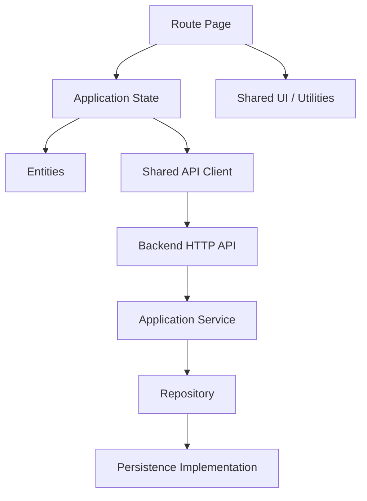

# NOMAD Architecture

## Active architecture

NOMAD currently runs as a browser-native modular application with a separately executable HTTP API. The architecture deliberately keeps transport, state, domain data and presentation isolated so the future React/Next.js migration can preserve the same contracts.



## Frontend boundaries

- **app/** — bootstrap, hash router, shell lifecycle and route registry.
- **pages/** — route-level composition and event binding; no direct storage access.
- **entities/** — canonical Place/Food data and pure Trip state transitions.
- **shared/** — storage, API transport and pure calculations.
- **styles/base.css** — tokens and global primitives.
- **styles/layout.css** — geometry, grids and stable media boxes.
- **styles/components.css** — reusable controls and global image fallback styling.
- **styles/nomad.css** — page composition and typography only.
- **styles/responsive.css** — viewport-specific overrides.

## Backend boundaries

- **api/** translates HTTP requests into application calls.
- **application/** contains use cases and structured Result responses.
- **domain/** owns repository/domain contracts.
- **infrastructure/** contains concrete repository implementations.

## Persistence status

The backend uses a JSON-file Trip repository by default and an in-memory repository for isolated tests. The HTTP and application contracts are independent from the concrete repository, so PostgreSQL/Prisma can replace the persistence implementation without changing page code or HTTP routes.

## Migration path

```text
stable vanilla runtime
        ↓
TypeScript domain contracts
        ↓
Next.js App Router
        ↓
TanStack Query for server state
        ↓
FSD production layers
        ↓
PostgreSQL / Prisma persistence
```
